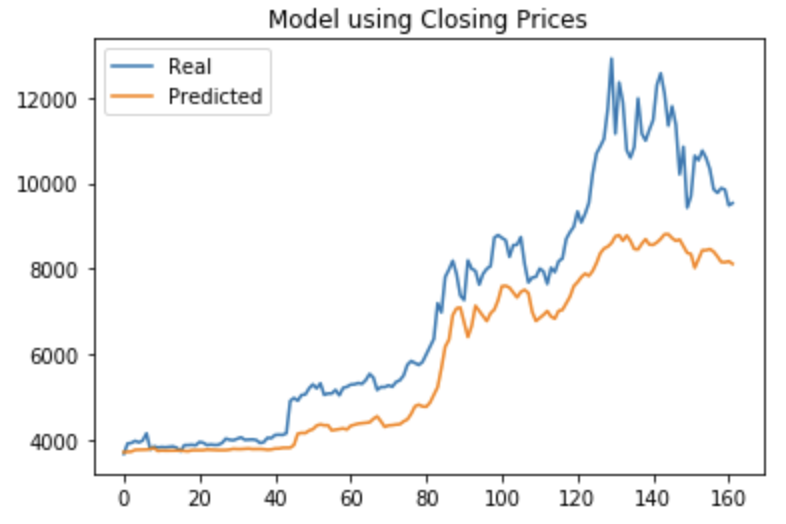
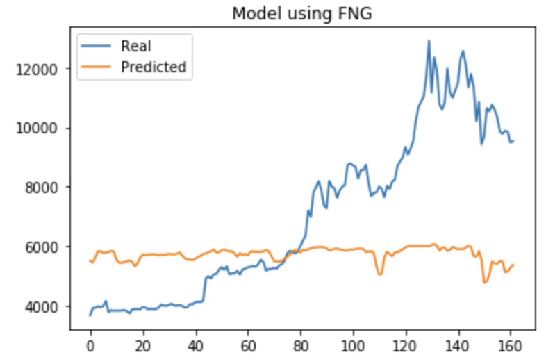

### Predicting Bitcoin Closing Prices based on previous Closing Prices and Sentiment.

## Files

[Closing Prices Starter Notebook](Starter_Code/lstm_stock_predictor_closing.ipynb)

[FNG Starter Notebook](Starter_Code/lstm_stock_predictor_fng.ipynb)

- - -

## Process:

### Data Preparation

1. Get Closing prices and Sentiment Data.
2. Predict Closing Prices using a 2 day window of previous closing prices and FNG Index (Files in Started Code)
3. Split the data into 70% training and 30% testing
4. Apply the MinMaxScaler to the X and y values
5. Reshape the X_train and X_test data for the model.

- - -

### Build and Train the LSTM RNN

1. Define the model architecture (number_units = 20)
2. Compile the models
3. Fit the model to the training data (epochs=40)

- - -

## Results:

### Which model has a lower loss?

Model using previous Closing Prices has lower Loss (loss: 0.0167) vs model using FNG Index (loss: 0.0948)

### Which model tracks the actual values better over time?

Model using previous Closing Prices is more accurate:

### Which window size works best for the model?

I tried many. Finally Window Size = 2 was the best one across both models.

- - -
